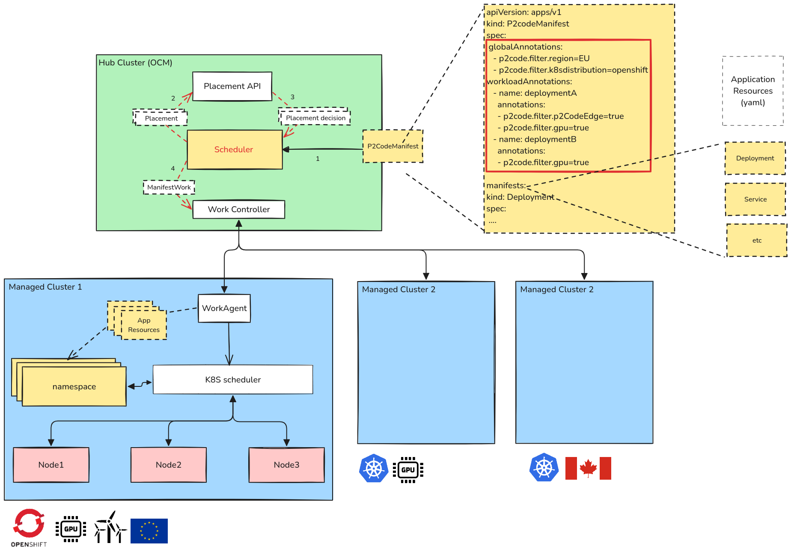

# Architecture Overview

This document provides a comprehensive overview of the P2Code Scheduler Operator's architecture, design patterns, and internal components.

## High-Level Architecture

The P2Code Scheduler Operator is built as a Kubernetes operator using the Kubebuilder framework. It integrates with Open Cluster Management (OCM) to provide intelligent multi-cluster workload scheduling.



### Architecture Diagram

```
┌─────────────────────────────────────────────────────────────────┐
│                        User / Developer                         │
│                                                                 │
│  Creates P2CodeSchedulingManifest with workloads + filters     │
└────────────────────────────┬────────────────────────────────────┘
                             │
                             │ kubectl apply
                             ▼
┌─────────────────────────────────────────────────────────────────┐
│                   Kubernetes API Server                         │
│                                                                 │
│  - Stores P2CodeSchedulingManifest CRs                         │
│  - Triggers reconciliation events                              │
└────────────────────────────┬────────────────────────────────────┘
                             │
                             │ Watch events
                             ▼
┌─────────────────────────────────────────────────────────────────┐
│          P2Code Scheduler Operator (Controller Manager)         │
│                                                                 │
│  ┌───────────────────────────────────────────────────────────┐ │
│  │   P2CodeSchedulingManifestReconciler                      │ │
│  │                                                           │ │
│  │   Main reconciliation loop orchestrating:                │ │
│  │   1. Validation                                           │ │
│  │   2. Analysis & Bundling                                  │ │
│  │   3. Placement Creation                                   │ │
│  │   4. ManifestWork Distribution                            │ │
│  │   5. Status Updates                                       │ │
│  └───────────┬───────────────────────────────────────────────┘ │
│              │                                                   │
│              │ Delegates to                                     │
│              ▼                                                   │
│  ┌──────────────────────┐  ┌──────────────────────┐            │
│  │  Annotation Parser   │  │  Membership Validator│            │
│  │  (annotations.go)    │  │  (membership.go)     │            │
│  └──────────────────────┘  └──────────────────────┘            │
│              │                                                   │
│              ▼                                                   │
│  ┌──────────────────────┐  ┌──────────────────────┐            │
│  │  Resource Analyzer   │  │  Bundle Manager      │            │
│  │  (analyse.go)        │  │  (bundle.go)         │            │
│  └──────────────────────┘  └──────────────────────┘            │
│              │                                                   │
│              ▼                                                   │
│  ┌──────────────────────┐  ┌──────────────────────┐            │
│  │  Network Connectivity│  │  Status Manager      │            │
│  │  (network-*.go)      │  │  (status.go)         │            │
│  └──────────────────────┘  └──────────────────────┘            │
└─────────────────────────────┬───────────────────────────────────┘
                              │
                              │ Creates & Manages
                              ▼
┌─────────────────────────────────────────────────────────────────┐
│              Open Cluster Management (OCM)                      │
│                                                                 │
│  ┌──────────────┐  ┌──────────────┐  ┌──────────────────────┐ │
│  │  Placement   │  │ Placement    │  │   ManifestWork       │ │
│  │  Resources   │─▶│ Decisions    │  │   Resources          │ │
│  │              │  │              │  │                      │ │
│  │ Cluster      │  │ Selected     │  │ Workload bundles to  │ │
│  │ selection    │  │ clusters     │  │ deploy               │ │
│  └──────────────┘  └──────────────┘  └──────────┬───────────┘ │
└───────────────────────────────────────────────────┼─────────────┘
                                                    │
                                                    │ Distributes
                                                    ▼
┌─────────────────────────────────────────────────────────────────┐
│                    Managed Clusters                             │
│                                                                 │
│  ┌──────────────┐  ┌──────────────┐  ┌──────────────────────┐ │
│  │  Cluster 1   │  │  Cluster 2   │  │   Cluster N          │ │
│  │              │  │              │  │                      │ │
│  │ Workloads    │  │ Workloads    │  │   Workloads          │ │
│  │ deployed     │  │ deployed     │  │   deployed           │ │
│  └──────────────┘  └──────────────┘  └──────────────────────┘ │
└─────────────────────────────────────────────────────────────────┘
                              │
                              │ Optional: Multi-cluster networking
                              ▼
┌─────────────────────────────────────────────────────────────────┐
│              AC3 Network Operator (Optional)                    │
│                                                                 │
│  Manages MultiClusterNetwork resources for service discovery   │
└─────────────────────────────────────────────────────────────────┘
```

## Core Components

### 1. Custom Resource Definition (CRD)

#### P2CodeSchedulingManifest

**Location**: `/api/v1alpha1/p2codeschedulingmanifest_types.go`

The primary API resource that users interact with. It defines:

**Spec Fields**:
- `globalAnnotations` (optional): List of filter annotations applied to all manifests
- `workloadAnnotations` (optional): Map of workload names to their specific filter annotations
- `manifests` (required): Array of raw Kubernetes manifests to schedule

**Status Fields**:
- `conditions`: Array of condition objects tracking scheduling state
- `decisions`: Array of scheduling decisions (workload → cluster mappings)
- `state`: High-level state indicator

**Example**:
```yaml
apiVersion: scheduling.p2code.eu/v1alpha1
kind: P2CodeSchedulingManifest
metadata:
  name: example-scheduling
  namespace: p2code-scheduler-system
spec:
  globalAnnotations:
    - "p2code.filter.location=europe"
  manifests:
    - apiVersion: apps/v1
      kind: Deployment
      # ... deployment spec
status:
  conditions:
    - type: SchedulingSuccessful
      status: "True"
  decisions:
    - workload: my-deployment
      cluster: cluster-eu-01
```

### 2. Main Reconciler

#### P2CodeSchedulingManifestReconciler

**Location**: `/internal/controller/p2codeschedulingmanifest_controller.go`

The main controller that orchestrates the entire scheduling process. It implements the standard Kubernetes controller-runtime reconciliation pattern.

**Reconciliation Flow**:

```go
1. Retrieve P2CodeSchedulingManifest resource
2. Add finalizer for cleanup management
3. Handle deletion (if DeletionTimestamp is set)
   └─▶ Clean up ManifestWorks, Placements, Network links
4. Validate configuration
   ├─▶ Validate annotation syntax
   ├─▶ Check cluster membership
   └─▶ Verify manifest structure
5. Parse and process annotations
6. Analyze manifests and create bundles
7. For each bundle:
   ├─▶ Create Placement resource
   ├─▶ Wait for PlacementDecision
   └─▶ Create ManifestWork for each selected cluster
8. Register network connectivity (if needed)
9. Update status with decisions and conditions
10. Return reconcile result
```

**Watched Resources**:
- `P2CodeSchedulingManifest` (primary resource)
- `Placement` (owns)
- `ManifestWork` (owns)
- `PlacementDecision` (references)

**RBAC Permissions**:
```yaml
# P2CodeSchedulingManifest management
- apiGroups: ["scheduling.p2code.eu"]
  resources: ["p2codeschedulingmanifests", "p2codeschedulingmanifests/status", "p2codeschedulingmanifests/finalizers"]
  verbs: ["get", "list", "watch", "create", "update", "patch", "delete"]

# OCM resources
- apiGroups: ["cluster.open-cluster-management.io"]
  resources: ["placements", "placementdecisions", "managedclusters", "managedclustersets"]
  verbs: ["get", "list", "watch", "create", "update", "patch", "delete"]

# ManifestWork
- apiGroups: ["work.open-cluster-management.io"]
  resources: ["manifestworks"]
  verbs: ["get", "list", "watch", "create", "update", "patch", "delete"]

# Network operator (optional)
- apiGroups: ["ac3network.p2code.eu"]
  resources: ["multiclusternetworks"]
  verbs: ["get", "list", "watch", "create", "update", "patch", "delete"]
```

### 3. Supporting Modules

#### Annotation Parser (`annotations.go`)

**Responsibilities**:
- Validates annotation format (`p2code.filter.key=value`)
- Extracts filter key-value pairs
- Maps workload names to their annotation constraints

**Key Functions**:
```go
func validateAnnotations(annotations []string) error
func parseAnnotation(annotation string) (key, value string, error)
```

#### Resource Analyzer (`analyse.go`)

**Responsibilities**:
- Deep introspection of Kubernetes manifests
- Extracts metadata, specifications, and dependencies
- Identifies workload types (Deployment, StatefulSet, etc.)
- Analyzes service definitions, network policies, RBAC resources
- Detects external service dependencies in Pod specs
- Handles OpenShift-specific resources (Routes)
- Recognizes monitoring resources (ServiceMonitor)

**Key Functions**:
```go
func analyseManifest(manifest unstructured.Unstructured) (*ResourceSet, error)
func extractPodSpec(obj unstructured.Unstructured) (*corev1.PodSpec, error)
func analyseService(obj unstructured.Unstructured) (*ResourceSet, error)
func extractExternalServices(podSpec *corev1.PodSpec) []string
```

**Supported Resource Types**:
- **Workloads**: Deployment, StatefulSet, DaemonSet, Pod, Job, CronJob
- **Services**: Service, Endpoints, EndpointSlice
- **Config**: ConfigMap, Secret
- **Networking**: NetworkPolicy, Ingress, Route (OpenShift)
- **RBAC**: ServiceAccount, Role, ClusterRole, RoleBinding, ClusterRoleBinding
- **Autoscaling**: HorizontalPodAutoscaler (v1, v2, v2beta1, v2beta2)
- **Monitoring**: ServiceMonitor (Prometheus Operator)
- **Storage**: PersistentVolume, PersistentVolumeClaim

#### Bundle Manager (`bundle.go`)

**Responsibilities**:
- Groups related resources into deployable bundles
- Associates placement constraints with resource groups
- Manages bundle lifecycle

**Data Structures**:
```go
type Bundle struct {
    Name        string          // Workload name
    Annotations []string        // Filter annotations
    Resources   ResourceSet     // All resources in bundle
}

type BundleList struct {
    Bundles []Bundle
}
```

**Key Functions**:
```go
func createBundle(name string, annotations []string, resources ResourceSet) Bundle
func (bl *BundleList) Add(bundle Bundle)
func (bl *BundleList) Get(name string) (*Bundle, bool)
```

#### Resource Set (`resourceset.go`)

**Responsibilities**:
- Abstracts resource collections
- Provides deduplication
- Categorizes workload vs. supporting resources
- Manages resource metadata

**Data Structure**:
```go
type Resource struct {
    Name      string
    Namespace string
    GVK       schema.GroupVersionKind
    Labels    map[string]string
    Object    unstructured.Unstructured
}

type ResourceSet struct {
    Resources []Resource
}
```

**Key Functions**:
```go
func (rs *ResourceSet) Add(resource Resource)
func (rs *ResourceSet) Contains(name, namespace string, gvk schema.GroupVersionKind) bool
func (rs *ResourceSet) Merge(other ResourceSet)
```

#### Membership Validator (`membership.go`)

**Responsibilities**:
- Validates ManagedClusterSet existence
- Checks ManagedClusterSetBinding to namespace
- Ensures proper cluster federation setup

**Key Functions**:
```go
func validateClusterSetMembership(ctx context.Context, client client.Client, clusterSetName, namespace string) error
```

#### Network Connectivity Manager (`network-connectivity.go`)

**Responsibilities**:
- Analyzes external service dependencies between workloads
- Creates MultiClusterNetwork resources for cross-cluster communication
- Registers network links with AC3 Network Operator
- Handles graceful degradation if network operator not installed

**Key Functions**:
```go
func registerNetworkConnectivity(ctx context.Context, client client.Client, decisions []Decision, bundles BundleList) error
func createMultiClusterNetwork(name, sourceCluster, targetCluster, service string) *unstructured.Unstructured
func isMultiClusterNetworkInstalled(ctx context.Context, client client.Client) bool
```

**Network Resource Example**:
```yaml
apiVersion: ac3network.p2code.eu/v1alpha1
kind: MultiClusterNetwork
metadata:
  name: frontend-to-backend-link
spec:
  sourceCluster: cluster-eu-01
  targetCluster: cluster-us-01
  service: backend-service
```

#### Status Manager (`status.go`)

**Responsibilities**:
- Updates CR status with conditions
- Records scheduling decisions
- Manages condition transitions
- Provides user-friendly status messages

**Condition Types**:
- `SchedulingInProgress`: Scheduling is underway
- `SchedulingSuccessful`: All workloads scheduled successfully
- `ScheduledWithUnreliableConnectivity`: Scheduled but network links unavailable
- `SchedulingFailed`: Scheduling failed
- `Misconfigured`: Configuration error detected
- `SchedulingError`: Unexpected error occurred

**Key Functions**:
```go
func setCondition(manifest *v1alpha1.P2CodeSchedulingManifest, conditionType, reason, message string)
func recordDecision(manifest *v1alpha1.P2CodeSchedulingManifest, workload, cluster string)
```

#### Utilities (`utils/utils.go`)

**Responsibilities**:
- Name truncation for Kubernetes resource limits (max 253 characters)
- MultiClusterNetwork API detection

**Key Functions**:
```go
func TruncateName(name string, maxLength int) string
func IsMultiClusterNetworkInstalled(ctx context.Context, client client.Client) bool
```

## Data Flow

### End-to-End Scheduling Flow

```
1. User creates P2CodeSchedulingManifest
   ↓
2. Reconciler receives watch event
   ↓
3. Validation Phase
   ├─ Validate annotations (annotations.go)
   ├─ Validate cluster membership (membership.go)
   └─ Validate manifest structure
   ↓
4. Analysis Phase
   ├─ Analyze each manifest (analyse.go)
   ├─ Extract resources, dependencies, services
   └─ Identify external service connections
   ↓
5. Bundling Phase
   ├─ Group resources by workload (bundle.go)
   ├─ Associate annotations with bundles
   └─ Create deployable units
   ↓
6. Placement Phase
   ├─ Convert annotations to label selectors
   ├─ Create Placement resource per bundle
   └─ Wait for PlacementDecision from OCM
   ↓
7. Distribution Phase
   ├─ For each PlacementDecision:
   │  ├─ Extract selected clusters
   │  └─ Create ManifestWork per cluster
   └─ Track deployment status
   ↓
8. Network Registration Phase
   ├─ Analyze inter-workload dependencies
   ├─ Check if AC3 Network Operator installed
   ├─ Create MultiClusterNetwork resources
   └─ Update status based on network availability
   ↓
9. Status Update Phase
   ├─ Record scheduling decisions
   ├─ Set appropriate conditions
   └─ Update CR status
   ↓
10. OCM distributes ManifestWorks to managed clusters
    ↓
11. Workloads deployed on target clusters
```

## Design Patterns

### 1. Finalizer Pattern

The operator uses Kubernetes finalizers to ensure proper cleanup:

```go
const finalizerName = "scheduling.p2code.eu/finalizer"

// Add finalizer on creation
if !controllerutil.ContainsFinalizer(manifest, finalizerName) {
    controllerutil.AddFinalizer(manifest, finalizerName)
    return ctrl.Result{Requeue: true}, nil
}

// Handle deletion
if !manifest.DeletionTimestamp.IsZero() {
    if controllerutil.ContainsFinalizer(manifest, finalizerName) {
        // Cleanup logic
        cleanupManifestWorks(...)
        cleanupPlacements(...)
        cleanupNetworkLinks(...)

        // Remove finalizer
        controllerutil.RemoveFinalizer(manifest, finalizerName)
        return ctrl.Result{}, nil
    }
}
```

### 2. Ownership Pattern

All created resources are labeled with ownership information:

```yaml
metadata:
  labels:
    p2code.scheduler/owner: <scheduling-manifest-name>
  ownerReferences:
    - apiVersion: scheduling.p2code.eu/v1alpha1
      kind: P2CodeSchedulingManifest
      name: <scheduling-manifest-name>
      uid: <uid>
      controller: true
      blockOwnerDeletion: true
```

This enables:
- Automatic garbage collection by Kubernetes
- Efficient resource lookup using label selectors
- Clear audit trail

### 3. Status Condition Pattern

Following Kubernetes conventions for status reporting:

```go
type Condition struct {
    Type               string
    Status             corev1.ConditionStatus  // True, False, Unknown
    LastTransitionTime metav1.Time
    Reason             string
    Message            string
}
```

### 4. Reconciliation Loop Pattern

Standard controller-runtime reconciliation with exponential backoff:

```go
func (r *Reconciler) Reconcile(ctx context.Context, req ctrl.Request) (ctrl.Result, error) {
    // Fetch resource
    // Process resource
    // Update status

    // Requeue if needed
    return ctrl.Result{RequeueAfter: 5 * time.Minute}, nil
}
```

### 5. Graceful Degradation

Optional features degrade gracefully:

```go
// Network operator integration
if isMultiClusterNetworkInstalled(ctx, r.Client) {
    registerNetworkConnectivity(...)
} else {
    log.Info("MultiClusterNetwork API not installed, skipping network registration")
}
```

## Integration Points

### 1. Open Cluster Management (OCM)

**Placement API**:
```yaml
apiVersion: cluster.open-cluster-management.io/v1beta1
kind: Placement
metadata:
  name: workload-placement
spec:
  clusterSets:
    - global
  predicates:
    - requiredClusterSelector:
        labelSelector:
          matchLabels:
            p2code.filter.location: europe
```

**ManifestWork API**:
```yaml
apiVersion: work.open-cluster-management.io/v1
kind: ManifestWork
metadata:
  name: workload-bundle
  namespace: cluster-eu-01
spec:
  workload:
    manifests:
      - # Kubernetes manifest
```

### 2. AC3 Network Operator

**MultiClusterNetwork**:
```yaml
apiVersion: ac3network.p2code.eu/v1alpha1
kind: MultiClusterNetwork
metadata:
  name: service-link
spec:
  sourceCluster: cluster-1
  targetCluster: cluster-2
  service: backend-service
```

## Deployment Architecture

### Namespace Requirement

All operations are scoped to the `p2code-scheduler-system` namespace:

```yaml
apiVersion: v1
kind: Namespace
metadata:
  name: p2code-scheduler-system
```

### Controller Deployment

```yaml
apiVersion: apps/v1
kind: Deployment
metadata:
  name: p2code-scheduler-controller-manager
  namespace: p2code-scheduler-system
spec:
  replicas: 1
  template:
    spec:
      containers:
        - name: manager
          image: p2code-scheduler:latest
          command:
            - /manager
          args:
            - --leader-elect
```

### Leader Election

The operator supports multiple replicas with leader election for high availability.

## Performance Considerations

### Caching

The operator uses controller-runtime's built-in caching:
- Watch events are cached locally
- List operations use cached data
- Reduces API server load

### Batching

Where possible, operations are batched:
- Multiple ManifestWorks created in parallel
- Bulk status updates

### Resource Naming

Names are truncated to comply with Kubernetes limits while maintaining readability:
```go
TruncateName("very-long-workload-name-that-exceeds-kubernetes-limits", 253)
```

## Security Architecture

### RBAC Model

Fine-grained permissions:
- Operator ServiceAccount has minimal required permissions
- User RBAC controls who can create P2CodeSchedulingManifests
- Separate permissions for OCM resources

### Secret Handling

- Secrets are included in bundles only when referenced
- Secrets are transmitted securely through ManifestWork
- No secrets stored in operator memory longer than necessary

## Error Handling Strategy

### Validation Errors

Fail fast with clear error messages in status conditions:
```yaml
conditions:
  - type: Misconfigured
    status: "True"
    reason: InvalidAnnotationFormat
    message: "Annotation must follow format 'p2code.filter.key=value'"
```

### Transient Errors

Retry with exponential backoff:
```go
return ctrl.Result{RequeueAfter: 30 * time.Second}, nil
```

### Permanent Errors

Set failed condition and stop reconciliation:
```go
setCondition(manifest, "SchedulingFailed", "ClusterSetNotFound", "...")
return ctrl.Result{}, nil  // Don't requeue
```

## Testing Strategy

### Unit Tests

- Test individual functions in isolation
- Mock Kubernetes client
- Validate annotation parsing, resource analysis, bundle creation

### Integration Tests

- Test against real Kubernetes cluster (using envtest)
- Validate CRD schema
- Test controller reconciliation logic

### End-to-End Tests

- Deploy operator to test cluster
- Create test P2CodeSchedulingManifest resources
- Validate workload distribution

## Observability

### Logging

Structured logging using controller-runtime's logger:
```go
log := log.FromContext(ctx)
log.Info("Creating placement", "name", placementName, "cluster", clusterName)
```

### Metrics

Standard controller-runtime metrics:
- Reconciliation duration
- Queue depth
- Error rates

### Events

Kubernetes events for major state transitions:
```go
r.Recorder.Event(manifest, corev1.EventTypeNormal, "SchedulingSuccessful", "All workloads scheduled")
```

## Summary

The P2Code Scheduler Operator is architected as a cloud-native Kubernetes controller following established patterns and best practices. Its modular design separates concerns, making it maintainable and extensible. Deep integration with OCM and optional integration with the AC3 Network Operator provide a complete multi-cluster scheduling solution.
